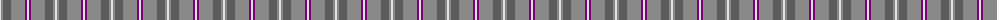
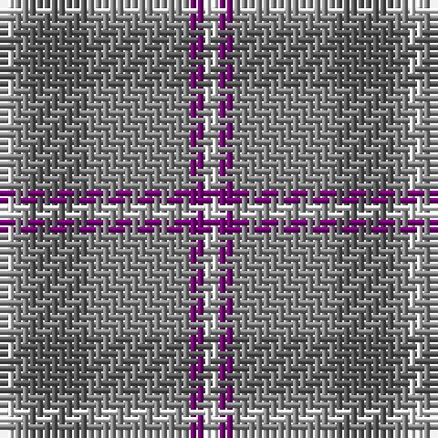

The parent of this is [Lochnagar Plaid (District)](/tartans/ln/2/na2/n8/na14/p2/ln/2/)

This was sourced from tartans-authority.  It is a [6 stripes tartan](/stripes/stripes6/).

Original link http://www.tartansauthority.com/tartan-ferret/display/1771/

## Thread count
LN/2 Na2 N8 Na14 P2 LN/2

## Palette
Each colour and its ΔE from the base-6 reference it is a variant of.

| Colour | Shade | Base | ΔE (OKLab) |
|---|---|---|---|
| LN |  `#E0E0E0` | W  | 0.06 |
| N |  `#5C5C5C` | B  | 0.14 |
| Na |  `#888888` | R  | 0.24 |
| P |  `#780078` | B  | 0.16 |

# Sample pattern

ID: /variants/ln/2/na2/n8/na14/p2/ln/2-lne0e0e0-n5c5c5c-na888888-p780078/
