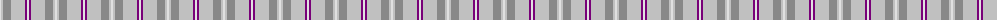
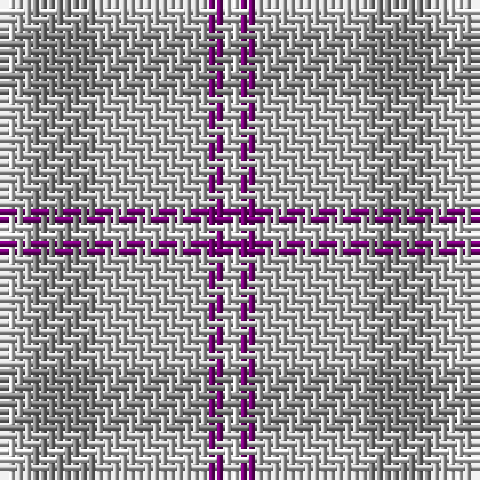

The parent of this is [Lochnagar Trade Tartan Tartan Number: 1771. Earliest known date: pre 2003 Colours represents the Scottish hills, the water, and the heather. See products available Copyright © Blair Urquhart, Comrie, 2015](/tartans/ln/2/na2/n8/na14/p2/ln/2/)

This was sourced from house-of-tartan.  It is a [6 stripes tartan](/stripes/stripes6/).

Original link http://www.house-of-tartan.scotland.net/house/TartanViewjs.asp?colr=Def&tnam=1771

## Thread count
LN/2 Na2 N8 Na14 P2 LN/2

## Palette
Each colour and its ΔE from the base-6 reference it is a variant of.

| Colour | Shade | Base | ΔE (OKLab) |
|---|---|---|---|
| LN |  `#E0E0E0` | W  | 0.06 |
| N |  `#888888` | R  | 0.24 |
| Na |  `#C0C0C0` | W  | 0.16 |
| P |  `#780078` | B  | 0.16 |

# Sample pattern

ID: /variants/ln/2/na2/n8/na14/p2/ln/2-lne0e0e0-n888888-nac0c0c0-p780078/
