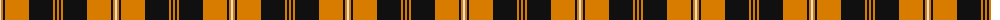
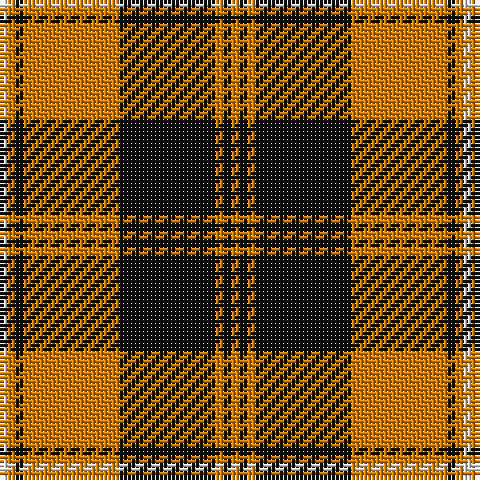

The parent of this is [Atlas Textile (Corporate)](/tartans/ln/2/o2/k2/o24/k24/o2/k2/o/2/)

This was sourced from tartans-authority.  It is a [8 stripes tartan](/stripes/stripes8/).

Original link http://www.tartansauthority.com/tartan-ferret/display/8090/

## Thread count
LN/2 O2 K2 O24 K24 O2 K2 O/2

## Palette
Each colour and its ΔE from the base-6 reference it is a variant of.

| Colour | Shade | Base | ΔE (OKLab) |
|---|---|---|---|
| K |  `#101010` | K  | 0.17 |
| LN |  `#E0E0E0` | W  | 0.06 |
| O |  `#D87C00` | Y  | 0.17 |

# Sample pattern

ID: /variants/ln/2/o2/k2/o24/k24/o2/k2/o/2-k101010-lne0e0e0-od87c00/
