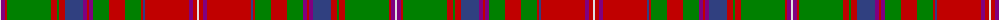

The parent of this is [MacDougall 7](/tartans/ln/2/p4/r2/g44/r6/g2/r6/b18/p4/r2/p4/g16/r16/g16/r2/b2/r44/p4/r4/ln/2/)

This was sourced from weddslist.  It is a [20 stripes tartan](/stripes/stripes20/).

Original link http://www.weddslist.com/cgi-bin/tartans/pg.pl?source=sts

## Thread count
LN/2 P4 R2 G44 R6 G2 R6 B18 P4 R2 P4 G16 R16 G16 R2 B2 R44 P4 R4 LN/2

## Palette
Each colour and its ΔE from the base-6 reference it is a variant of.

| Colour | Shade | Base | ΔE (OKLab) |
|---|---|---|---|
| B |  `#304080` | B  | 0.01 |
| G |  `#008000` | G  | 0.09 |
| LN |  `#E0E0E0` | W  | 0.06 |
| P |  `#800080` | B  | 0.17 |
| R |  `#C00000` | R  | 0.02 |

ID: /variants/ln/2/p4/r2/g44/r6/g2/r6/b18/p4/r2/p4/g16/r16/g16/r2/b2/r44/p4/r4/ln/2-b304080-g008000-lne0e0e0-p800080-rc00000/
