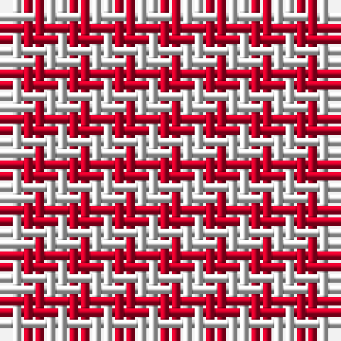

The parent of this is [MacMedic](/tartans/ln/2/r/2/)

This was sourced from register-of-tartans.  It is a [2 stripes tartan](/stripes/stripes2/).

Original link https://www.tartanregister.gov.uk/tartanDetails.aspx?ref=2654

## Thread count
LN/2 R/2

## Palette
LN R

# Sample pattern

ID: /variants/ln/2/r/2-lne0e0e0-rc80028/
