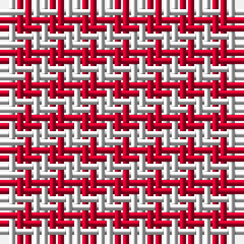

The parent of this is [McMedic (Fashion)](/tartans/ln/2/r/2/)

This was sourced from tartans-authority.  It is a [2 stripes tartan](/stripes/stripes2/).

Original link http://www.tartansauthority.com/tartan-ferret/display/2684/

## Thread count
LN/2 R/2

## Palette
Each colour and its ΔE from the base-6 reference it is a variant of.

| Colour | Shade | Base | ΔE (OKLab) |
|---|---|---|---|
| LN |  `#E0E0E0` | W  | 0.06 |
| R |  `#C8002C` | R  | 0.03 |

# Sample pattern

ID: /variants/ln/2/r/2-lne0e0e0-rc8002c/
