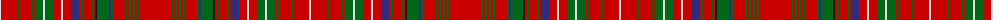

The parent of this is [MacDonald of Staffa Clan Tartan Tartan Number: 1529. Earliest known date: 1850 This plate is taken from the manuscript of William and Andrew Smith's 'Authenticated Tartans of the Clans and Families of Scotland'. The Smith's sources included the findings of George Hunter, an Army clothier, who toured the Highlands in search of old tartans prior to 1822. See products available Copyright © Blair Urquhart, Comrie, 2015](/tartans/ln/2/r16/g2/r12/g2/r2/g8/ln2/g8/r8/ln2/r8/db8/r2/g2/r8/g2/r2/k2/g12/db2/g2/r12/g2/r2/g2/r2/g2/r2/g2/r/32/)

This was sourced from house-of-tartan.  It is a [31 stripes tartan](/stripes/stripes31/).

Original link http://www.house-of-tartan.scotland.net/house/TartanViewjs.asp?colr=Def&tnam=1529

## Thread count
LN/2 R16 G2 R12 G2 R2 G8 LN2 G8 R8 LN2 R8 DB8 R2 G2 R8 G2 R2 K2 G12 DB2 G2 R12 G2 R2 G2 R2 G2 R2 G2 R/32

## Palette
Each colour and its ΔE from the base-6 reference it is a variant of.

| Colour | Shade | Base | ΔE (OKLab) |
|---|---|---|---|
| DB |  `#2C2C80` | B  | 0.05 |
| G |  `#006818` | G  | 0.02 |
| K |  `#101010` | K  | 0.17 |
| LN |  `#E0E0E0` | W  | 0.06 |
| R |  `#C80000` | R  | 0.00 |

ID: /variants/ln/2/r16/g2/r12/g2/r2/g8/ln2/g8/r8/ln2/r8/db8/r2/g2/r8/g2/r2/k2/g12/db2/g2/r12/g2/r2/g2/r2/g2/r2/g2/r/32-db2c2c80-g006818-k101010-lne0e0e0-rc80000/
