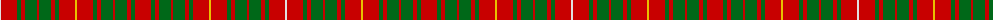

The parent of this is [Bruce (VS) Clan Tartan Tartan Number: 1848. Earliest known date: 1842 The design comes from the Vestiarium Scoticum, and is approved by Lord Bruce, Earl of Elgin. Much doubt has been cast on the authority of the Vestiarium, but in this case Lord Bruce believes he has independant evidence of the tartan dating back to 1571. The original document was a chart of the weavers threadcount which is now lost. The chart included black 'guards' on the yellow and white stripes and Lord Bruce has adopted this variation as his personal tartan. Writing in 1967, Lord Bruce also states that the Elgin family also wear the Bruce of Kinnaird for 'undress' or day wear, a wholly different tartan similar to the Prince Charles Edward. See products available Copyright © Blair Urquhart, Comrie, 2015](/tartans/ln/2/r16/g4/r4/g12/r2/g12/r4/g4/r16/y2/r16/g4/r4/g12/r2/g12/r4/g4/r/16/)

This was sourced from house-of-tartan.  It is a [20 stripes tartan](/stripes/stripes20/).

Original link http://www.house-of-tartan.scotland.net/house/TartanViewjs.asp?colr=Def&tnam=1848

## Thread count
LN/2 R16 G4 R4 G12 R2 G12 R4 G4 R16 Y2 R16 G4 R4 G12 R2 G12 R4 G4 R/16

## Palette
Each colour and its ΔE from the base-6 reference it is a variant of.

| Colour | Shade | Base | ΔE (OKLab) |
|---|---|---|---|
| G |  `#006818` | G  | 0.02 |
| LN |  `#E0E0E0` | W  | 0.06 |
| R |  `#C80000` | R  | 0.00 |
| Y |  `#E8C000` | Y  | 0.00 |

ID: /variants/ln/2/r16/g4/r4/g12/r2/g12/r4/g4/r16/y2/r16/g4/r4/g12/r2/g12/r4/g4/r/16-g006818-lne0e0e0-rc80000-ye8c000/
