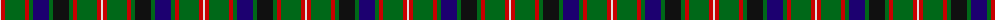

The parent of this is [Reid, Green (Name)](/tartans/ln/2/r4/g20/r4/g4/db16/g4/k16/g4/r4/g20/r4/ln/2/)

This was sourced from tartans-authority.  It is a [13 stripes tartan](/stripes/stripes13/).

Original link http://www.tartansauthority.com/tartan-ferret/display/2066/

## Thread count
LN/2 R4 G20 R4 G4 DB16 G4 K16 G4 R4 G20 R4 LN/2

## Palette
Each colour and its ΔE from the base-6 reference it is a variant of.

| Colour | Shade | Base | ΔE (OKLab) |
|---|---|---|---|
| DB |  `#1C0070` | B  | 0.14 |
| G |  `#006818` | G  | 0.02 |
| K |  `#101010` | K  | 0.17 |
| LN |  `#E0E0E0` | W  | 0.06 |
| R |  `#C80000` | R  | 0.00 |

ID: /variants/ln/2/r4/g20/r4/g4/db16/g4/k16/g4/r4/g20/r4/ln/2-db1c0070-g006818-k101010-lne0e0e0-rc80000/
