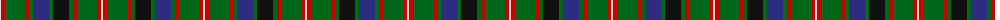

The parent of this is [Reid Family Tartan Tartan Number: 2066. Earliest known date: 1991 Designed for Mr. William Reid, President of DELCO Scottish games. See products available Copyright © Blair Urquhart, Comrie, 2015](/tartans/ln/2/r4/g20/r4/g4/db16/g4/k16/g4/r4/g20/r4/ln/2/)

This was sourced from house-of-tartan.  It is a [13 stripes tartan](/stripes/stripes13/).

Original link http://www.house-of-tartan.scotland.net/house/TartanViewjs.asp?colr=Def&tnam=2066

## Thread count
LN/2 R4 G20 R4 G4 DB16 G4 K16 G4 R4 G20 R4 LN/2

## Palette
Each colour and its ΔE from the base-6 reference it is a variant of.

| Colour | Shade | Base | ΔE (OKLab) |
|---|---|---|---|
| DB |  `#2C2C80` | B  | 0.05 |
| G |  `#006818` | G  | 0.02 |
| K |  `#101010` | K  | 0.17 |
| LN |  `#E0E0E0` | W  | 0.06 |
| R |  `#C80000` | R  | 0.00 |

ID: /variants/ln/2/r4/g20/r4/g4/db16/g4/k16/g4/r4/g20/r4/ln/2-db2c2c80-g006818-k101010-lne0e0e0-rc80000/
