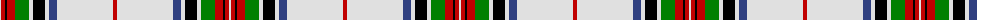

The parent of this is [Rothesay, Duke of](/tartans/ln/2/r4/k2/r8/g14/ln4/k12/ln4/b8/ln56/r/4/)

This was sourced from weddslist.  It is a [11 stripes tartan](/stripes/stripes11/).

Original link http://www.weddslist.com/cgi-bin/tartans/pg.pl?source=sts

## Thread count
LN/2 R4 K2 R8 G14 LN4 K12 LN4 B8 LN56 R/4

## Palette
Each colour and its ΔE from the base-6 reference it is a variant of.

| Colour | Shade | Base | ΔE (OKLab) |
|---|---|---|---|
| B |  `#304080` | B  | 0.01 |
| G |  `#008000` | G  | 0.09 |
| K |  `#000000` | K  | 0.00 |
| LN |  `#E0E0E0` | W  | 0.06 |
| R |  `#C00000` | R  | 0.02 |

ID: /variants/ln/2/r4/k2/r8/g14/ln4/k12/ln4/b8/ln56/r/4-b304080-g008000-k000000-lne0e0e0-rc00000/
