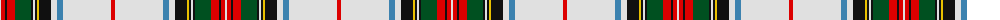

The parent of this is [Stuart/Stewart Victoria](/tartans/ln/2/r4/k2/r8/g16/k2/ln2/k2/y2/k12/ln6/b6/ln48/r/4/)

This was sourced from register-of-tartans.  It is a [14 stripes tartan](/stripes/stripes14/).

Original link https://www.tartanregister.gov.uk/tartanDetails.aspx?ref=4029

## Thread count
LN/2 R4 K2 R8 G16 K2 LN2 K2 Y2 K12 LN6 B6 LN48 R/4

## Palette
Each colour and its ΔE from the base-6 reference it is a variant of.

| Colour | Shade | Base | ΔE (OKLab) |
|---|---|---|---|
| B |  `#3C82AF` | B  | 0.20 |
| G |  `#005020` | G  | 0.08 |
| K |  `#101010` | K  | 0.17 |
| LN |  `#E0E0E0` | W  | 0.06 |
| R |  `#DC0000` | R  | 0.04 |
| Y |  `#E8C000` | Y  | 0.00 |

ID: /variants/ln/2/r4/k2/r8/g16/k2/ln2/k2/y2/k12/ln6/b6/ln48/r/4-b3c82af-g005020-k101010-lne0e0e0-rdc0000-ye8c000/
