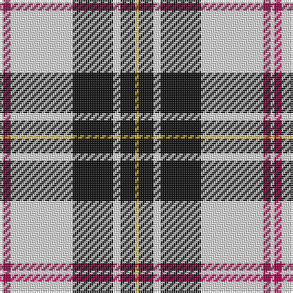

The parent of this is [MacPherson - 1842 (VS) Dress](/tartans/ln/2/r4/ln34/k22/ln4/k8/y/2/)

This was sourced from tartans-authority.  It is a [7 stripes tartan](/stripes/stripes7/).

Original link http://www.tartansauthority.com/tartan-ferret/display/1872/

## Thread count
LN/2 R4 LN34 K22 LN4 K8 Y/2

## Palette
Each colour and its ΔE from the base-6 reference it is a variant of.

| Colour | Shade | Base | ΔE (OKLab) |
|---|---|---|---|
| K |  `#101010` | K  | 0.17 |
| LN |  `#E0E0E0` | W  | 0.06 |
| R |  `#A00048` | R  | 0.11 |
| Y |  `#D8B000` | Y  | 0.05 |

# Sample pattern

ID: /variants/ln/2/r4/ln34/k22/ln4/k8/y/2-k101010-lne0e0e0-ra00048-yd8b000/
