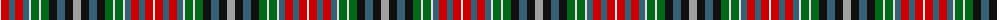

The parent of this is [Stanners Personal Tartan Tartan Number: 10096. Earliest known date: 2nd Nov. 2009 This tartan is for the use of the Stanners family who lived in Grangepans, Bo'ness, West Lothian, for 200 years. It is for family members, relatives and anyone linked to the family by marriage. Developed for weaving by House of Tartan. See products available Copyright © Blair Urquhart, Comrie, 2015](/tartans/ln/2/r8/b6/r8/b6/ln2/g8/ln2/g8/k8/b8/k8/n/8/)

This was sourced from house-of-tartan.  It is a [13 stripes tartan](/stripes/stripes13/).

Original link http://www.house-of-tartan.scotland.net/house/TartanViewjs.asp?colr=Def&tnam=10096

## Thread count
LN/2 R8 B6 R8 B6 LN2 G8 LN2 G8 K8 B8 K8 N/8

## Palette
Each colour and its ΔE from the base-6 reference it is a variant of.

| Colour | Shade | Base | ΔE (OKLab) |
|---|---|---|---|
| B |  `#386074` | B  | 0.11 |
| G |  `#006818` | G  | 0.02 |
| K |  `#101010` | K  | 0.17 |
| LN |  `#E0E0E0` | W  | 0.06 |
| N |  `#A0A0A0` | Y  | 0.20 |
| R |  `#C80000` | R  | 0.00 |

ID: /variants/ln/2/r8/b6/r8/b6/ln2/g8/ln2/g8/k8/b8/k8/n/8-b386074-g006818-k101010-lne0e0e0-na0a0a0-rc80000/
