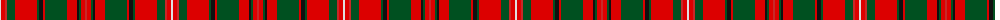

The parent of this is [MacKinnon #9](/tartans/ln/2/ra4/r2/g8/ra22/g2/k4/ra2/g22/ra10/k2/g2/ra4/r/2/)

This was sourced from register-of-tartans.  It is a [14 stripes tartan](/stripes/stripes14/).

Original link https://www.tartanregister.gov.uk/tartanDetails.aspx?ref=2553

## Thread count
LN/2 Ra4 R2 G8 Ra22 G2 K4 Ra2 G22 Ra10 K2 G2 Ra4 R/2

## Palette
Each colour and its ΔE from the base-6 reference it is a variant of.

| Colour | Shade | Base | ΔE (OKLab) |
|---|---|---|---|
| G |  `#005020` | G  | 0.08 |
| K |  `#101010` | K  | 0.17 |
| LN |  `#E0E0E0` | W  | 0.06 |
| R |  `#C82828` | R  | 0.03 |
| Ra |  `#DC0000` | R  | 0.04 |

ID: /variants/ln/2/ra4/r2/g8/ra22/g2/k4/ra2/g22/ra10/k2/g2/ra4/r/2-g005020-k101010-lne0e0e0-rc82828-radc0000/
