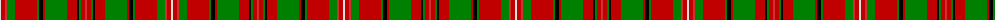

The parent of this is [MacKinnon 2](/tartans/ln/2/ra4/r2/g8/ra22/g2/k4/ra2/g22/ra10/k2/g2/ra4/r/2/)

This was sourced from weddslist.  It is a [14 stripes tartan](/stripes/stripes14/).

Original link http://www.weddslist.com/cgi-bin/tartans/pg.pl?source=sts

## Thread count
LN/2 Ra4 R2 G8 Ra22 G2 K4 Ra2 G22 Ra10 K2 G2 Ra4 R/2

## Palette
Each colour and its ΔE from the base-6 reference it is a variant of.

| Colour | Shade | Base | ΔE (OKLab) |
|---|---|---|---|
| G |  `#008000` | G  | 0.09 |
| K |  `#000000` | K  | 0.00 |
| LN |  `#E0E0E0` | W  | 0.06 |
| R |  `#D03030` | R  | 0.05 |
| Ra |  `#C00000` | R  | 0.02 |

ID: /variants/ln/2/ra4/r2/g8/ra22/g2/k4/ra2/g22/ra10/k2/g2/ra4/r/2-g008000-k000000-lne0e0e0-rd03030-rac00000/
