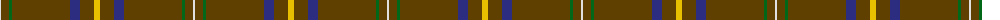

The parent of this is [Kozmyk (Corporate)](/tartans/ln/2/t8/g3/t58/db10/t14/y/6/)

This was sourced from tartans-authority.  It is a [7 stripes tartan](/stripes/stripes7/).

Original link http://www.tartansauthority.com/tartan-ferret/display/7948/

## Thread count
LN/2 T8 G3 T58 DB10 T14 Y/6

## Palette
Each colour and its ΔE from the base-6 reference it is a variant of.

| Colour | Shade | Base | ΔE (OKLab) |
|---|---|---|---|
| DB |  `#2C2C80` | B  | 0.05 |
| G |  `#006818` | G  | 0.02 |
| LN |  `#E0E0E0` | W  | 0.06 |
| T |  `#604000` | G  | 0.14 |
| Y |  `#E8C000` | Y  | 0.00 |

# Sample pattern

ID: /variants/ln/2/t8/g3/t58/db10/t14/y/6-db2c2c80-g006818-lne0e0e0-t604000-ye8c000/
