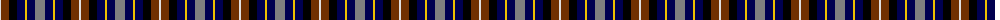
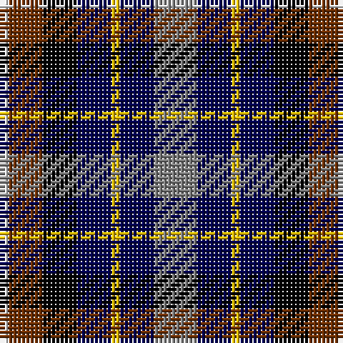

The parent of this is [Devon, Companion](/tartans/ln/2/t8/k8/db8/y2/db8/n/10/)

This was sourced from weddslist.  It is a [7 stripes tartan](/stripes/stripes7/).

Original link http://www.weddslist.com/cgi-bin/tartans/pg.pl?source=sts

## Thread count
LN/2 T8 K8 DB8 Y2 DB8 N/10

## Palette
Each colour and its ΔE from the base-6 reference it is a variant of.

| Colour | Shade | Base | ΔE (OKLab) |
|---|---|---|---|
| DB |  `#000050` | B  | 0.20 |
| K |  `#000000` | K  | 0.00 |
| LN |  `#E0E0E0` | W  | 0.06 |
| N |  `#808080` | G  | 0.22 |
| T |  `#703000` | R  | 0.18 |
| Y |  `#F0C000` | Y  | 0.01 |

# Sample pattern

ID: /variants/ln/2/t8/k8/db8/y2/db8/n/10-db000050-k000000-lne0e0e0-n808080-t703000-yf0c000/
