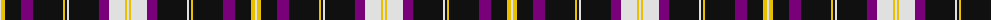

The parent of this is [Freger](/tartans/ln/2/y4/k16/p12/k30/y2/k2/ln2/k30/p10/ln16/y2/ln/2/)

This was sourced from register-of-tartans.  It is a [13 stripes tartan](/stripes/stripes13/).

Original link https://www.tartanregister.gov.uk/tartanDetails.aspx?ref=5567

## Thread count
LN/2 Y4 K16 P12 K30 Y2 K2 LN2 K30 P10 LN16 Y2 LN/2

## Palette
Each colour and its ΔE from the base-6 reference it is a variant of.

| Colour | Shade | Base | ΔE (OKLab) |
|---|---|---|---|
| K |  `#101010` | K  | 0.17 |
| LN |  `#E0E0E0` | W  | 0.06 |
| P |  `#780078` | B  | 0.16 |
| Y |  `#E8C000` | Y  | 0.00 |

ID: /variants/ln/2/y4/k16/p12/k30/y2/k2/ln2/k30/p10/ln16/y2/ln/2-k101010-lne0e0e0-p780078-ye8c000/
