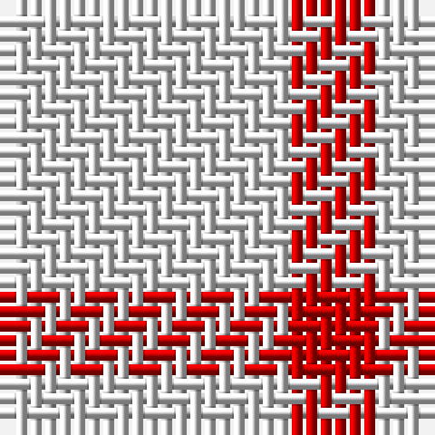

The parent of this is [English Kilt (Fashion)](/tartans/ln/20/r/6/)

This was sourced from tartans-authority.  It is a [2 stripes tartan](/stripes/stripes2/).

Original link http://www.tartansauthority.com/tartan-ferret/display/8127/

## Thread count
LN/20 R/6

## Palette
LN R

# Sample pattern

ID: /variants/ln/20/r/6-lne0e0e0-rc80000/
