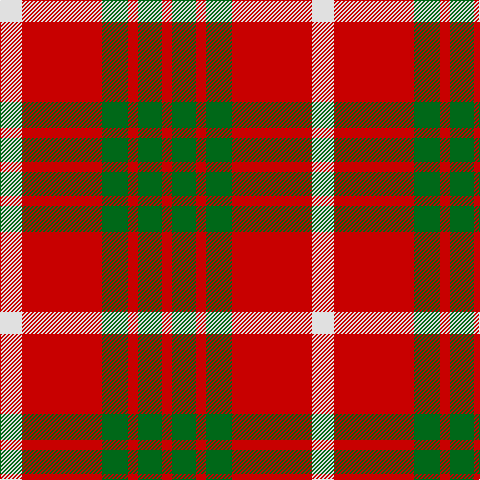

The parent of this is [Makhtoum Regimental Tartan Tartan Number: 1531. Earliest known date: 1977 Based on Cameron. Designed for HH Shaikh Rashid Bin Saeed al-Maktoum, the ruler of Dubai, for the Dubai Pipe Band. See products available Copyright © Blair Urquhart, Comrie, 2015](/tartans/ln/22/r80/g26/r10/g24/r/10/)

This was sourced from house-of-tartan.  It is a [6 stripes tartan](/stripes/stripes6/).

Original link http://www.house-of-tartan.scotland.net/house/TartanViewjs.asp?colr=Def&tnam=1531

## Thread count
LN/22 R80 G26 R10 G24 R/10

## Palette
Each colour and its ΔE from the base-6 reference it is a variant of.

| Colour | Shade | Base | ΔE (OKLab) |
|---|---|---|---|
| G |  `#006818` | G  | 0.02 |
| LN |  `#E0E0E0` | W  | 0.06 |
| R |  `#C80000` | R  | 0.00 |

# Sample pattern

ID: /variants/ln/22/r80/g26/r10/g24/r/10-g006818-lne0e0e0-rc80000/
