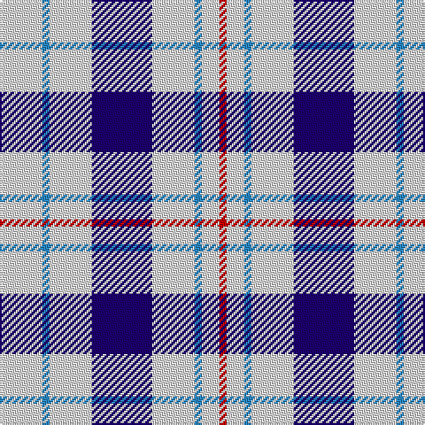

The parent of this is [Milne Dress, Royal Blue (Dance)](/tartans/ln/24/b4/ln24/db34/ln24/b4/ln10/r/4/)

This was sourced from tartans-authority.  It is a [8 stripes tartan](/stripes/stripes8/).

Original link http://www.tartansauthority.com/tartan-ferret/display/6547/

## Thread count
LN/24 B4 LN24 DB34 LN24 B4 LN10 R/4

## Palette
Each colour and its ΔE from the base-6 reference it is a variant of.

| Colour | Shade | Base | ΔE (OKLab) |
|---|---|---|---|
| B |  `#2888C4` | B  | 0.21 |
| DB |  `#1C0070` | B  | 0.14 |
| LN |  `#E0E0E0` | W  | 0.06 |
| R |  `#C80000` | R  | 0.00 |

# Sample pattern

ID: /variants/ln/24/b4/ln24/db34/ln24/b4/ln10/r/4-b2888c4-db1c0070-lne0e0e0-rc80000/
