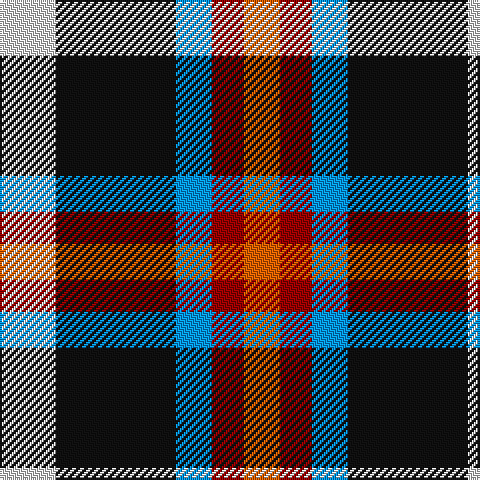

The parent of this is [Heidrick Family (Personal)](/tartans/ln/28/k60/b18/dr16/o/18/)

This was sourced from register-of-tartans.  It is a [5 stripes tartan](/stripes/stripes5/).

Original link https://www.tartanregister.gov.uk/tartanDetails.aspx?ref=11403

## Thread count
LN/28 K60 B18 DR16 O/18

## Palette
Each colour and its ΔE from the base-6 reference it is a variant of.

| Colour | Shade | Base | ΔE (OKLab) |
|---|---|---|---|
| B |  `#0596FA` | B  | 0.28 |
| DR |  `#960000` | R  | 0.11 |
| K |  `#101010` | K  | 0.17 |
| LN |  `#E0E0E0` | W  | 0.06 |
| O |  `#E86000` | R  | 0.14 |

# Sample pattern

ID: /variants/ln/28/k60/b18/dr16/o/18-b0596fa-dr960000-k101010-lne0e0e0-oe86000/
