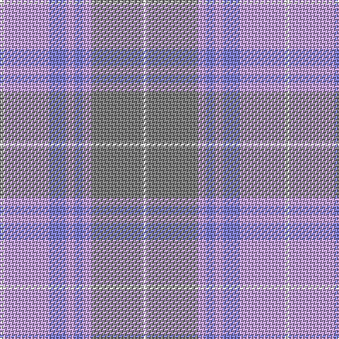

The parent of this is [Tenmaya](/tartans/ln/3/lp32/b12/lp6/b6/lp6/n36/ln/3/)

This was sourced from weddslist.  It is a [8 stripes tartan](/stripes/stripes8/).

Original link http://www.weddslist.com/cgi-bin/tartans/pg.pl?source=sts

## Thread count
LN/3 LP32 B12 LP6 B6 LP6 N36 LN/3

## Palette
Each colour and its ΔE from the base-6 reference it is a variant of.

| Colour | Shade | Base | ΔE (OKLab) |
|---|---|---|---|
| B |  `#8080D0` | B  | 0.24 |
| LN |  `#E0E0E0` | W  | 0.06 |
| LP |  `#C0A0E0` | W  | 0.23 |
| N |  `#808080` | G  | 0.22 |

# Sample pattern

ID: /variants/ln/3/lp32/b12/lp6/b6/lp6/n36/ln/3-b8080d0-lne0e0e0-lpc0a0e0-n808080/
