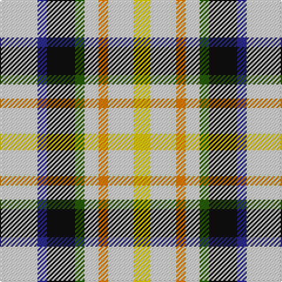

The parent of this is [MacLaren Dress (Dance)](/tartans/ln/32/db8/k24/g8/ln12/o8/ln22/y/14/)

This was sourced from tartans-authority.  It is a [8 stripes tartan](/stripes/stripes8/).

Original link http://www.tartansauthority.com/tartan-ferret/display/1770/

## Thread count
LN/32 DB8 K24 G8 LN12 O8 LN22 Y/14

## Palette
Each colour and its ΔE from the base-6 reference it is a variant of.

| Colour | Shade | Base | ΔE (OKLab) |
|---|---|---|---|
| DB |  `#2C2C80` | B  | 0.05 |
| G |  `#285800` | G  | 0.04 |
| K |  `#101010` | K  | 0.17 |
| LN |  `#E0E0E0` | W  | 0.06 |
| O |  `#D87C00` | Y  | 0.17 |
| Y |  `#E8C000` | Y  | 0.00 |

# Sample pattern

ID: /variants/ln/32/db8/k24/g8/ln12/o8/ln22/y/14-db2c2c80-g285800-k101010-lne0e0e0-od87c00-ye8c000/
