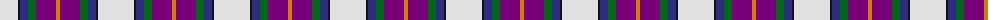
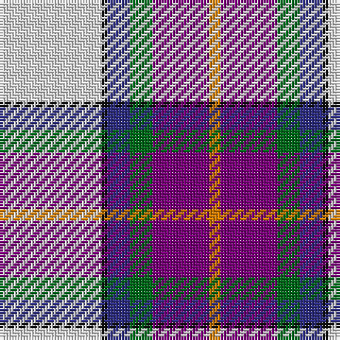

The parent of this is [Edgar-Feyen (Personal)](/tartans/ln/36/k2/db8/g8/p20/o/4/)

This was sourced from tartans-authority.  It is a [6 stripes tartan](/stripes/stripes6/).

Original link http://www.tartansauthority.com/tartan-ferret/display/10216/

## Thread count
LN/36 K2 DB8 G8 P20 O/4

## Palette
Each colour and its ΔE from the base-6 reference it is a variant of.

| Colour | Shade | Base | ΔE (OKLab) |
|---|---|---|---|
| DB |  `#2C2C80` | B  | 0.05 |
| G |  `#006818` | G  | 0.02 |
| K |  `#101010` | K  | 0.17 |
| LN |  `#E0E0E0` | W  | 0.06 |
| O |  `#D87C00` | Y  | 0.17 |
| P |  `#780078` | B  | 0.16 |

# Sample pattern

ID: /variants/ln/36/k2/db8/g8/p20/o/4-db2c2c80-g006818-k101010-lne0e0e0-od87c00-p780078/
