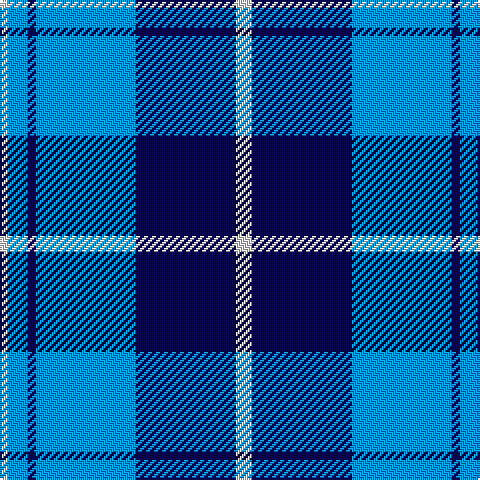

The parent of this is [Douglas Variation](/tartans/ln/4/b10/db4/b50/db50/ln/8/)

This was sourced from register-of-tartans.  It is a [6 stripes tartan](/stripes/stripes6/).

Original link https://www.tartanregister.gov.uk/tartanDetails.aspx?ref=962

## Thread count
LN/4 B10 DB4 B50 DB50 LN/8

## Palette
Each colour and its ΔE from the base-6 reference it is a variant of.

| Colour | Shade | Base | ΔE (OKLab) |
|---|---|---|---|
| B |  `#0596FA` | B  | 0.28 |
| DB |  `#080848` | B  | 0.19 |
| LN |  `#E0E0E0` | W  | 0.06 |

# Sample pattern

ID: /variants/ln/4/b10/db4/b50/db50/ln/8-b0596fa-db080848-lne0e0e0/
