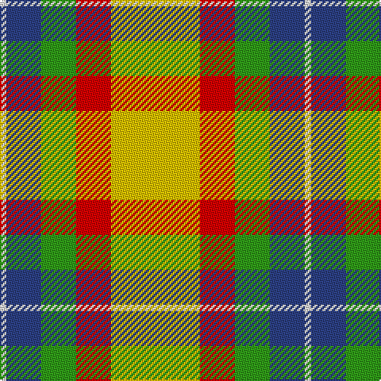

The parent of this is [Samye #2](/tartans/ln/4/b22/g22/r22/y/56/)

This was sourced from register-of-tartans.  It is a [5 stripes tartan](/stripes/stripes5/).

Original link https://www.tartanregister.gov.uk/tartanDetails.aspx?ref=5888

## Thread count
LN/4 B22 G22 R22 Y/56

## Palette
Each colour and its ΔE from the base-6 reference it is a variant of.

| Colour | Shade | Base | ΔE (OKLab) |
|---|---|---|---|
| B |  `#2C4084` | B  | 0.00 |
| G |  `#309C18` | G  | 0.18 |
| LN |  `#E0E0E0` | W  | 0.06 |
| R |  `#DC0000` | R  | 0.04 |
| Y |  `#E8C000` | Y  | 0.00 |

# Sample pattern

ID: /variants/ln/4/b22/g22/r22/y/56-b2c4084-g309c18-lne0e0e0-rdc0000-ye8c000/
