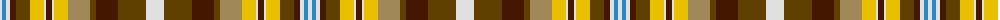

The parent of this is [Bonnie Prince Charlie (Fashion)](/tartans/ln/4/b4/ln4/dr6/t14/y14/ln2/dr6/ln2/y14/lt22/t6/dr22/t28/ln/18/)

This was sourced from tartans-authority.  It is a [15 stripes tartan](/stripes/stripes15/).

Original link http://www.tartansauthority.com/tartan-ferret/display/2382/

## Thread count
LN/4 B4 LN4 DR6 T14 Y14 LN2 DR6 LN2 Y14 LT22 T6 DR22 T28 LN/18

## Palette
Each colour and its ΔE from the base-6 reference it is a variant of.

| Colour | Shade | Base | ΔE (OKLab) |
|---|---|---|---|
| B |  `#2888C4` | B  | 0.21 |
| DR |  `#441800` | B  | 0.22 |
| LN |  `#E0E0E0` | W  | 0.06 |
| LT |  `#A08858` | Y  | 0.21 |
| T |  `#604000` | G  | 0.14 |
| Y |  `#E8C000` | Y  | 0.00 |

ID: /variants/ln/4/b4/ln4/dr6/t14/y14/ln2/dr6/ln2/y14/lt22/t6/dr22/t28/ln/18-b2888c4-dr441800-lne0e0e0-lta08858-t604000-ye8c000/
