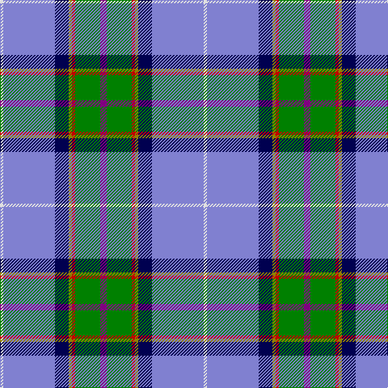

The parent of this is [Manx National](/tartans/ln/4/b64/db17/lg4/r4/g31/p/8/)

This was sourced from weddslist.  It is a [7 stripes tartan](/stripes/stripes7/).

Original link http://www.weddslist.com/cgi-bin/tartans/pg.pl?source=sts

## Thread count
LN/4 B64 DB17 LG4 R4 G31 P/8

## Palette
Each colour and its ΔE from the base-6 reference it is a variant of.

| Colour | Shade | Base | ΔE (OKLab) |
|---|---|---|---|
| B |  `#8080D0` | B  | 0.24 |
| DB |  `#000050` | B  | 0.20 |
| G |  `#008000` | G  | 0.09 |
| LG |  `#908000` | G  | 0.19 |
| LN |  `#E0E0E0` | W  | 0.06 |
| P |  `#800080` | B  | 0.17 |
| R |  `#C00000` | R  | 0.02 |

# Sample pattern

ID: /variants/ln/4/b64/db17/lg4/r4/g31/p/8-b8080d0-db000050-g008000-lg908000-lne0e0e0-p800080-rc00000/
