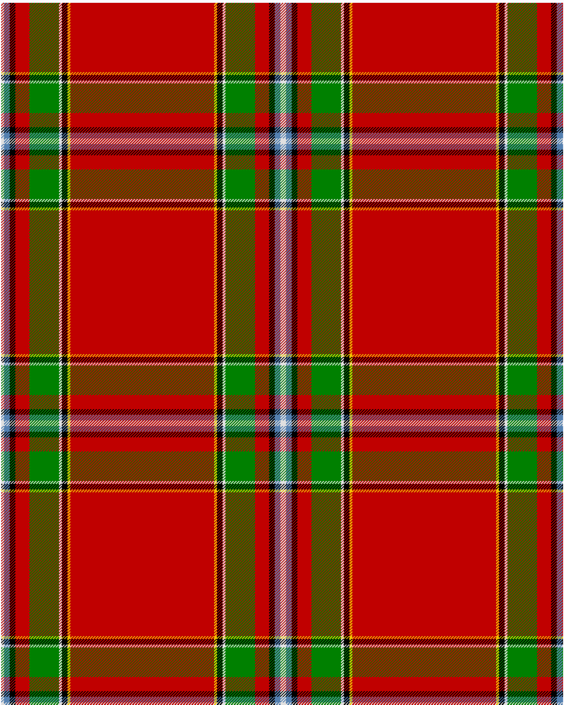

The parent of this is [Drummond of Perth](/tartans/ln/4/b8/k8/r20/g42/ln4/k8/y4/r/102/)

This was sourced from <no value>.  It is a [9 stripes tartan](/stripes/stripes9/).

Original link http://www.weddslist.com/cgi-bin/tartans/pg.pl?source=sts

## Thread count
LN/4 B8 K8 R20 G42 LN4 K8 Y4 R/102

## Palette
B G K LN R Y

# Sample pattern

ID: /variants/ln/4/b8/k8/r20/g42/ln4/k8/y4/r/102-b5480b0-g008000-k000000-lne0e0e0-rc00000-yf0c000/