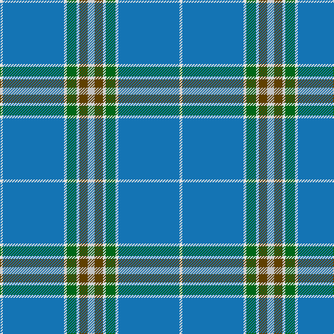

The parent of this is [Leblant-Macqueron (Personal)](/tartans/ln/4/b88/ln4/g14/ln4/t12/n/10/)

This was sourced from tartans-authority.  It is a [7 stripes tartan](/stripes/stripes7/).

Original link http://www.tartansauthority.com/tartan-ferret/display/10609/

## Thread count
LN/4 B88 LN4 G14 LN4 T12 N/10

## Palette
Each colour and its ΔE from the base-6 reference it is a variant of.

| Colour | Shade | Base | ΔE (OKLab) |
|---|---|---|---|
| B |  `#1474B4` | B  | 0.15 |
| G |  `#006818` | G  | 0.02 |
| LN |  `#E0E0E0` | W  | 0.06 |
| N |  `#C0C0C0` | W  | 0.16 |
| T |  `#604000` | G  | 0.14 |

# Sample pattern

ID: /variants/ln/4/b88/ln4/g14/ln4/t12/n/10-b1474b4-g006818-lne0e0e0-nc0c0c0-t604000/
