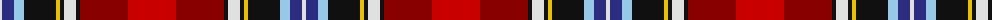

The parent of this is [Scotland's International - Away (Fas](/tartans/ln/4/db12/lb10/k32/y4/k4/ln12/k4/dr48/r/48/)

This was sourced from tartans-authority.  It is a [10 stripes tartan](/stripes/stripes10/).

Original link http://www.tartansauthority.com/tartan-ferret/display/7841/

## Thread count
LN/4 DB12 LB10 K32 Y4 K4 LN12 K4 DR48 R/48

## Palette
Each colour and its ΔE from the base-6 reference it is a variant of.

| Colour | Shade | Base | ΔE (OKLab) |
|---|---|---|---|
| DB |  `#2C2C80` | B  | 0.05 |
| DR |  `#880000` | R  | 0.14 |
| K |  `#101010` | K  | 0.17 |
| LB |  `#98C8E8` | W  | 0.17 |
| LN |  `#E0E0E0` | W  | 0.06 |
| R |  `#C80000` | R  | 0.00 |
| Y |  `#E8C000` | Y  | 0.00 |

ID: /variants/ln/4/db12/lb10/k32/y4/k4/ln12/k4/dr48/r/48-db2c2c80-dr880000-k101010-lb98c8e8-lne0e0e0-rc80000-ye8c000/
