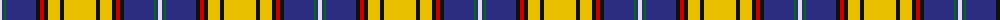

The parent of this is [Otago Corporate District Tartan Tartan Number: 2317. Earliest known date: 1996 Otago's colours are blue and gold. White on blue is the St Andrews Cross, gold is for the gold discovered in Otago. The black divides the gold to show that the miners came from the four quarters of the world. Red is for the blood ties in the Old Country and black for mourning loved ones never to be seen again. See products available Copyright © Blair Urquhart, Comrie, 2015](/tartans/ln/4/db2/g2/db30/k4/r4/k4/y12/k4/y/32/)

This was sourced from house-of-tartan.  It is a [10 stripes tartan](/stripes/stripes10/).

Original link http://www.house-of-tartan.scotland.net/house/TartanViewjs.asp?colr=Def&tnam=2317

## Thread count
LN/4 DB2 G2 DB30 K4 R4 K4 Y12 K4 Y/32

## Palette
Each colour and its ΔE from the base-6 reference it is a variant of.

| Colour | Shade | Base | ΔE (OKLab) |
|---|---|---|---|
| DB |  `#2C2C80` | B  | 0.05 |
| G |  `#006818` | G  | 0.02 |
| K |  `#101010` | K  | 0.17 |
| LN |  `#E0E0E0` | W  | 0.06 |
| R |  `#C80000` | R  | 0.00 |
| Y |  `#E8C000` | Y  | 0.00 |

ID: /variants/ln/4/db2/g2/db30/k4/r4/k4/y12/k4/y/32-db2c2c80-g006818-k101010-lne0e0e0-rc80000-ye8c000/
