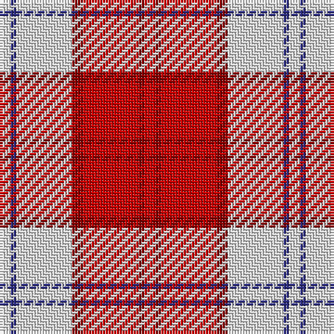

The parent of this is [Lennox Dress, Red (Dance)](/tartans/ln/4/db2/ln20/dr4/r20/dr2/r/4/)

This was sourced from tartans-authority.  It is a [7 stripes tartan](/stripes/stripes7/).

Original link http://www.tartansauthority.com/tartan-ferret/display/1649/

## Thread count
LN/4 DB2 LN20 DR4 R20 DR2 R/4

## Palette
Each colour and its ΔE from the base-6 reference it is a variant of.

| Colour | Shade | Base | ΔE (OKLab) |
|---|---|---|---|
| DB |  `#2C2C80` | B  | 0.05 |
| DR |  `#880000` | R  | 0.14 |
| LN |  `#E0E0E0` | W  | 0.06 |
| R |  `#C80000` | R  | 0.00 |

# Sample pattern

ID: /variants/ln/4/db2/ln20/dr4/r20/dr2/r/4-db2c2c80-dr880000-lne0e0e0-rc80000/
