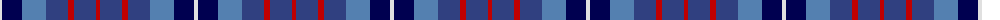

The parent of this is [Blue](/tartans/ln/4/db20/ba24/b22/r6/b22/r/4/)

This was sourced from weddslist.  It is a [7 stripes tartan](/stripes/stripes7/).

Original link http://www.weddslist.com/cgi-bin/tartans/pg.pl?source=sts

## Thread count
LN/4 DB20 Ba24 B22 R6 B22 R/4

## Palette
Each colour and its ΔE from the base-6 reference it is a variant of.

| Colour | Shade | Base | ΔE (OKLab) |
|---|---|---|---|
| B |  `#304080` | B  | 0.01 |
| Ba |  `#5480B0` | B  | 0.20 |
| DB |  `#000050` | B  | 0.20 |
| LN |  `#E0E0E0` | W  | 0.06 |
| R |  `#C00000` | R  | 0.02 |

# Sample pattern

ID: /variants/ln/4/db20/ba24/b22/r6/b22/r/4-b304080-ba5480b0-db000050-lne0e0e0-rc00000/
