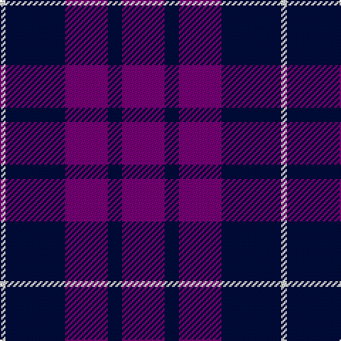

The parent of this is [Highland Spirit (Fashion)](/tartans/ln/4/db42/p30/db10/p/30/)

This was sourced from tartans-authority.  It is a [5 stripes tartan](/stripes/stripes5/).

Original link http://www.tartansauthority.com/tartan-ferret/display/5739/

## Thread count
LN/4 DB42 P30 DB10 P/30

## Palette
Each colour and its ΔE from the base-6 reference it is a variant of.

| Colour | Shade | Base | ΔE (OKLab) |
|---|---|---|---|
| DB |  `#000C3C` | B  | 0.21 |
| LN |  `#E0E0E0` | W  | 0.06 |
| P |  `#780078` | B  | 0.16 |

# Sample pattern

ID: /variants/ln/4/db42/p30/db10/p/30-db000c3c-lne0e0e0-p780078/
