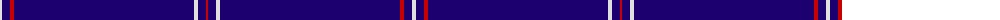

The parent of this is [Spirit of Ulster (Fashion)](/tartans/ln/4/db8/r4/db180/ln4/db8/r/2/)

This was sourced from tartans-authority.  It is a [7 stripes tartan](/stripes/stripes7/).

Original link http://www.tartansauthority.com/tartan-ferret/display/7194/

## Thread count
LN/4 DB8 R4 DB180 LN4 DB8 R/2

## Palette
Each colour and its ΔE from the base-6 reference it is a variant of.

| Colour | Shade | Base | ΔE (OKLab) |
|---|---|---|---|
| DB |  `#1C0070` | B  | 0.14 |
| LN |  `#E0E0E0` | W  | 0.06 |
| R |  `#C80000` | R  | 0.00 |

# Sample pattern

ID: /variants/ln/4/db8/r4/db180/ln4/db8/r/2-db1c0070-lne0e0e0-rc80000/
