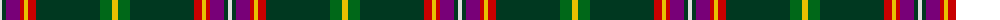

The parent of this is [Pienaar (Personal)](/tartans/ln/4/dg4/p14/r4/y4/r8/dg64/g12/y/6/)

This was sourced from tartans-authority.  It is a [9 stripes tartan](/stripes/stripes9/).

Original link http://www.tartansauthority.com/tartan-ferret/display/6872/

## Thread count
LN/4 DG4 P14 R4 Y4 R8 DG64 G12 Y/6

## Palette
Each colour and its ΔE from the base-6 reference it is a variant of.

| Colour | Shade | Base | ΔE (OKLab) |
|---|---|---|---|
| DG |  `#003820` | G  | 0.16 |
| G |  `#006818` | G  | 0.02 |
| LN |  `#E0E0E0` | W  | 0.06 |
| P |  `#780078` | B  | 0.16 |
| R |  `#C80000` | R  | 0.00 |
| Y |  `#E8C000` | Y  | 0.00 |

ID: /variants/ln/4/dg4/p14/r4/y4/r8/dg64/g12/y/6-dg003820-g006818-lne0e0e0-p780078-rc80000-ye8c000/
