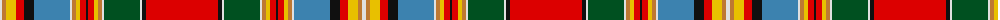

The parent of this is [Chattan (brown stripe variation)](/tartans/ln/4/do4/y10/r8/k10/b36/ln2/do4/y4/r6/k2/r6/y4/do4/ln2/g36/ln2/k4/r/72/)

This was sourced from register-of-tartans.  It is a [19 stripes tartan](/stripes/stripes19/).

Original link https://www.tartanregister.gov.uk/tartanDetails.aspx?ref=623

## Thread count
LN/4 DO4 Y10 R8 K10 B36 LN2 DO4 Y4 R6 K2 R6 Y4 DO4 LN2 G36 LN2 K4 R/72

## Palette
Each colour and its ΔE from the base-6 reference it is a variant of.

| Colour | Shade | Base | ΔE (OKLab) |
|---|---|---|---|
| B |  `#3C82AF` | B  | 0.20 |
| DO |  `#BE7832` | R  | 0.17 |
| G |  `#005020` | G  | 0.08 |
| K |  `#101010` | K  | 0.17 |
| LN |  `#E0E0E0` | W  | 0.06 |
| R |  `#DC0000` | R  | 0.04 |
| Y |  `#E8C000` | Y  | 0.00 |

ID: /variants/ln/4/do4/y10/r8/k10/b36/ln2/do4/y4/r6/k2/r6/y4/do4/ln2/g36/ln2/k4/r/72-b3c82af-dobe7832-g005020-k101010-lne0e0e0-rdc0000-ye8c000/
