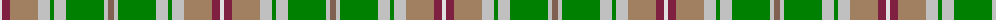

The parent of this is [Royal Pharmaceutical, Society](/tartans/ln/4/dr8/lt28/n12/g4/n12/g38/n4/lta/6/)

This was sourced from weddslist.  It is a [9 stripes tartan](/stripes/stripes9/).

Original link http://www.weddslist.com/cgi-bin/tartans/pg.pl?source=sts

## Thread count
LN/4 DR8 LT28 N12 G4 N12 G38 N4 LTa/6

## Palette
Each colour and its ΔE from the base-6 reference it is a variant of.

| Colour | Shade | Base | ΔE (OKLab) |
|---|---|---|---|
| DR |  `#802040` | R  | 0.16 |
| G |  `#008000` | G  | 0.09 |
| LN |  `#E0E0E0` | W  | 0.06 |
| LT |  `#A08060` | R  | 0.20 |
| LTa |  `#806050` | R  | 0.17 |
| N |  `#C0C0C0` | W  | 0.16 |

ID: /variants/ln/4/dr8/lt28/n12/g4/n12/g38/n4/lta/6-dr802040-g008000-lne0e0e0-lta08060-lta806050-nc0c0c0/
