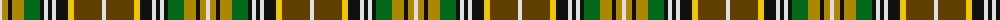

The parent of this is [O'Farrell Irish Family Tartan Tartan Number: 1875. Earliest known date: c1880 This pattern was recorded by Bill Johnston, Shippak, USA in 1978 along with other patterns extracted from the 'Clan Originaux' at Pendleton Mill. This and other Irish patterns appear to have originated in the former Waterford Mill in Ireland before they arrived at Pendleton in the late 19thC See products available Copyright © Blair Urquhart, Comrie, 2015](/tartans/ln/4/dy6/k4/dy12/g16/k4/ln4/k4/ln4/k12/y6/t28/ln/4/)

This was sourced from house-of-tartan.  It is a [13 stripes tartan](/stripes/stripes13/).

Original link http://www.house-of-tartan.scotland.net/house/TartanViewjs.asp?colr=Def&tnam=1875

## Thread count
LN/4 DY6 K4 DY12 G16 K4 LN4 K4 LN4 K12 Y6 T28 LN/4

## Palette
Each colour and its ΔE from the base-6 reference it is a variant of.

| Colour | Shade | Base | ΔE (OKLab) |
|---|---|---|---|
| DY |  `#B08800` | Y  | 0.18 |
| G |  `#006818` | G  | 0.02 |
| K |  `#101010` | K  | 0.17 |
| LN |  `#E0E0E0` | W  | 0.06 |
| LT |  `#A08858` | Y  | 0.21 |
| T |  `#604000` | G  | 0.14 |
| Y |  `#ECC800` | Y  | 0.02 |

ID: /variants/ln/4/dy6/k4/dy12/g16/k4/ln4/k4/ln4/k12/y6/t28/ln/4-dyb08800-g006818-k101010-lne0e0e0-lta08858-t604000-yecc800/
