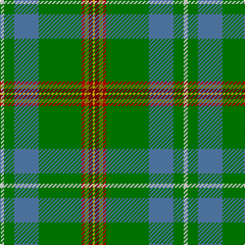

The parent of this is [Muskoka](/tartans/ln/4/g10/b24/g42/r3/lg4/dr4/y/2/)

This was sourced from weddslist.  It is a [8 stripes tartan](/stripes/stripes8/).

Original link http://www.weddslist.com/cgi-bin/tartans/pg.pl?source=sts

## Thread count
LN/4 G10 B24 G42 R3 LG4 DR4 Y/2

## Palette
Each colour and its ΔE from the base-6 reference it is a variant of.

| Colour | Shade | Base | ΔE (OKLab) |
|---|---|---|---|
| B |  `#5480B0` | B  | 0.20 |
| DR |  `#800000` | R  | 0.16 |
| G |  `#008000` | G  | 0.09 |
| LG |  `#908000` | G  | 0.19 |
| LN |  `#E0E0E0` | W  | 0.06 |
| R |  `#C00000` | R  | 0.02 |
| Y |  `#F0C000` | Y  | 0.01 |

# Sample pattern

ID: /variants/ln/4/g10/b24/g42/r3/lg4/dr4/y/2-b5480b0-dr800000-g008000-lg908000-lne0e0e0-rc00000-yf0c000/
