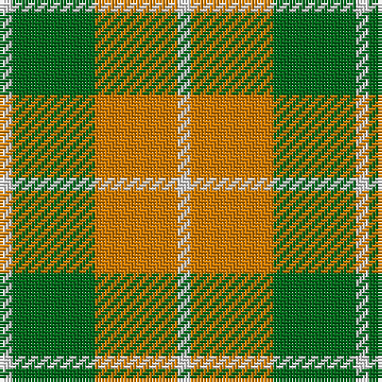

The parent of this is [Dunoon Irish Corporate Tartan Tartan Number: 1802. Earliest known date: 1935 Glasgow Irish Pipe Band See products available Copyright © Blair Urquhart, Comrie, 2015](/tartans/ln/4/g26/o26/ln/4/)

This was sourced from house-of-tartan.  It is a [4 stripes tartan](/stripes/stripes4/).

Original link http://www.house-of-tartan.scotland.net/house/TartanViewjs.asp?colr=Def&tnam=1802

## Thread count
LN/4 G26 O26 LN/4

## Palette
Each colour and its ΔE from the base-6 reference it is a variant of.

| Colour | Shade | Base | ΔE (OKLab) |
|---|---|---|---|
| G |  `#006818` | G  | 0.02 |
| LN |  `#E0E0E0` | W  | 0.06 |
| O |  `#D87C00` | Y  | 0.17 |

# Sample pattern

ID: /variants/ln/4/g26/o26/ln/4-g006818-lne0e0e0-od87c00/
