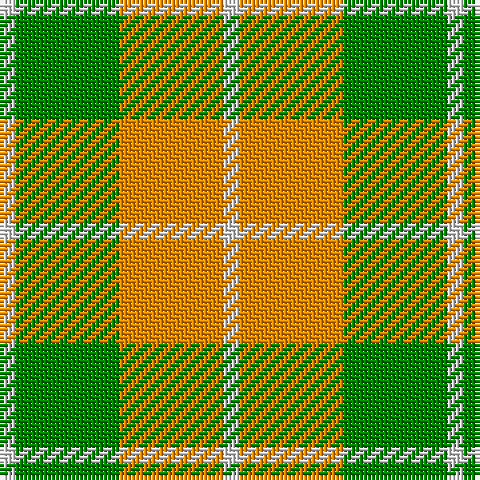

The parent of this is [Dunoon](/tartans/ln/4/g26/o26/ln/4/)

This was sourced from weddslist.  It is a [4 stripes tartan](/stripes/stripes4/).

Original link http://www.weddslist.com/cgi-bin/tartans/pg.pl?source=sts

## Thread count
LN/4 G26 O26 LN/4

## Palette
Each colour and its ΔE from the base-6 reference it is a variant of.

| Colour | Shade | Base | ΔE (OKLab) |
|---|---|---|---|
| G |  `#008000` | G  | 0.09 |
| LN |  `#E0E0E0` | W  | 0.06 |
| O |  `#FF8500` | Y  | 0.14 |

# Sample pattern

ID: /variants/ln/4/g26/o26/ln/4-g008000-lne0e0e0-off8500/
