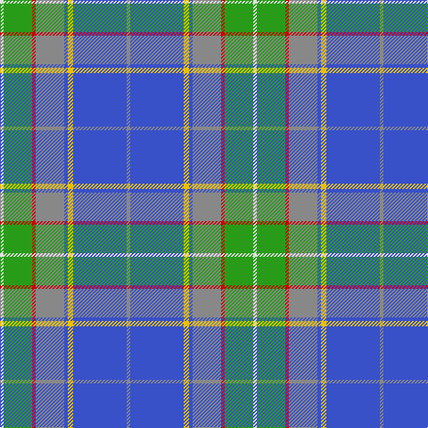

The parent of this is [WCWM 3947](/tartans/ln/4/g32/r4/n32/b4/y6/b60/n/4/)

This was sourced from tartans-authority.  It is a [8 stripes tartan](/stripes/stripes8/).

Original link http://www.tartansauthority.com/tartan-ferret/display/8259/

## Thread count
LN/4 G32 R4 N32 B4 Y6 B60 N/4

## Palette
Each colour and its ΔE from the base-6 reference it is a variant of.

| Colour | Shade | Base | ΔE (OKLab) |
|---|---|---|---|
| B |  `#3850C8` | B  | 0.12 |
| G |  `#289C18` | G  | 0.18 |
| LN |  `#E0E0E0` | W  | 0.06 |
| N |  `#888888` | R  | 0.24 |
| R |  `#C80000` | R  | 0.00 |
| Y |  `#E8C000` | Y  | 0.00 |

# Sample pattern

ID: /variants/ln/4/g32/r4/n32/b4/y6/b60/n/4-b3850c8-g289c18-lne0e0e0-n888888-rc80000-ye8c000/
