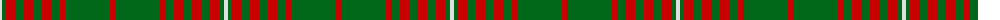

The parent of this is [Princess Marina Royal Tartan Tartan Number: 1468. Earliest known date: pre 2003 Colours reversed from MacGregor See products available Copyright © Blair Urquhart, Comrie, 2015](/tartans/ln/4/g4/r10/g8/r10/g8/r10/g8/r6/g8/g36/r/6/)

This was sourced from house-of-tartan.  It is a [12 stripes tartan](/stripes/stripes12/).

Original link http://www.house-of-tartan.scotland.net/house/TartanViewjs.asp?colr=Def&tnam=1468

## Thread count
LN/4 G4 R10 G8 R10 G8 R10 G8 R6 G8 G36 R/6

## Palette
Each colour and its ΔE from the base-6 reference it is a variant of.

| Colour | Shade | Base | ΔE (OKLab) |
|---|---|---|---|
| G |  `#006818` | G  | 0.02 |
| LN |  `#E0E0E0` | W  | 0.06 |
| R |  `#C80000` | R  | 0.00 |

ID: /variants/ln/4/g4/r10/g8/r10/g8/r10/g8/r6/g8/g36/r/6-g006818-lne0e0e0-rc80000/
