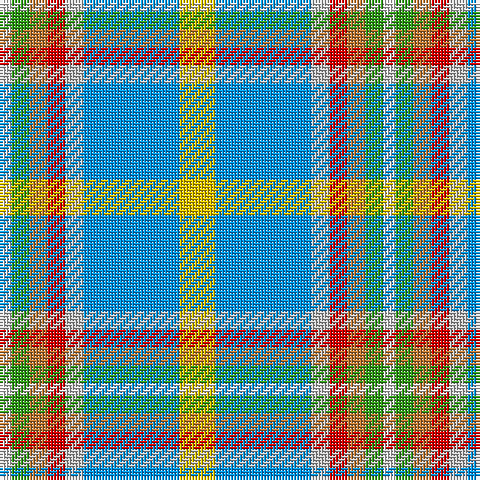

The parent of this is [Atikokan](/tartans/ln/4/g6/do6/r6/n6/b32/y/12/)

This was sourced from register-of-tartans.  It is a [7 stripes tartan](/stripes/stripes7/).

Original link https://www.tartanregister.gov.uk/tartanDetails.aspx?ref=126

## Thread count
LN/4 G6 DO6 R6 N6 B32 Y/12

## Palette
Each colour and its ΔE from the base-6 reference it is a variant of.

| Colour | Shade | Base | ΔE (OKLab) |
|---|---|---|---|
| B |  `#0596FA` | B  | 0.28 |
| DO |  `#BE7832` | R  | 0.17 |
| G |  `#309C18` | G  | 0.18 |
| LN |  `#E0E0E0` | W  | 0.06 |
| N |  `#C0C0C0` | W  | 0.16 |
| R |  `#DC0000` | R  | 0.04 |
| Y |  `#E8C000` | Y  | 0.00 |

# Sample pattern

ID: /variants/ln/4/g6/do6/r6/n6/b32/y/12-b0596fa-dobe7832-g309c18-lne0e0e0-nc0c0c0-rdc0000-ye8c000/
