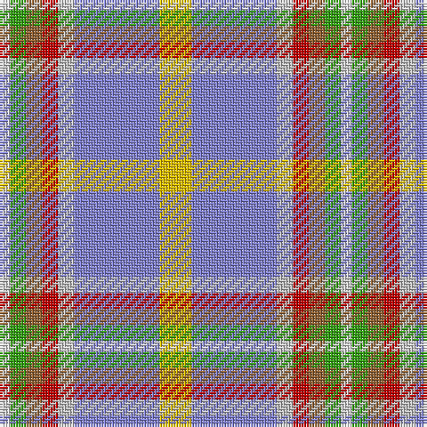

The parent of this is [Atikokan](/tartans/ln/4/g6/lt6/r6/n6/b32/y/12/)

This was sourced from weddslist.  It is a [7 stripes tartan](/stripes/stripes7/).

Original link http://www.weddslist.com/cgi-bin/tartans/pg.pl?source=sts

## Thread count
LN/4 G6 LT6 R6 N6 B32 Y/12

## Palette
Each colour and its ΔE from the base-6 reference it is a variant of.

| Colour | Shade | Base | ΔE (OKLab) |
|---|---|---|---|
| B |  `#8080D0` | B  | 0.24 |
| G |  `#30A010` | G  | 0.19 |
| LN |  `#E0E0E0` | W  | 0.06 |
| LT |  `#906030` | R  | 0.15 |
| N |  `#C0C0C0` | W  | 0.16 |
| R |  `#C00000` | R  | 0.02 |
| Y |  `#F0C000` | Y  | 0.01 |

# Sample pattern

ID: /variants/ln/4/g6/lt6/r6/n6/b32/y/12-b8080d0-g30a010-lne0e0e0-lt906030-nc0c0c0-rc00000-yf0c000/
