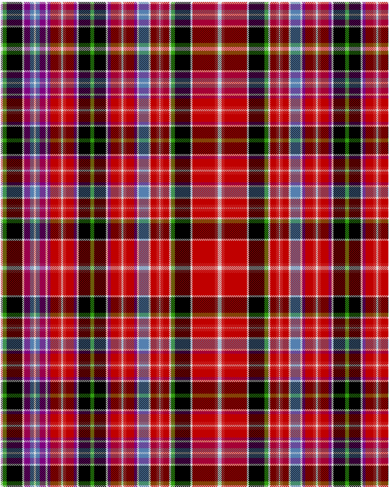

Aberdeen

This was sourced from <no value>.  It is a 44 stripes tartan.

Original link http://www.weddslist.com/cgi-bin/tartans/pg.pl?source=sts

## Thread count
LN/4 G8 K32 LN4 P12 B8 LN4 B8 P12 LN4 P6 RA16 R6 LN4 R6 RA16 P6 LN4 K24 G8 K24 LN4 P6 RA16 R6 LN4 R6 RA16 P6 LN4 B20 LN4 RA12 R6 LN2 R6 RA12 LN4 G8 K32 LN4 RA46 R6 LN/4

## Palette
B#5480B0 G#30A010 K#000000 LN#E0E0E0 P#800080 R#D03030 RA#C00000

# Sample pattern

ID: /variants/ln/4/g8/k32/ln4/p12/b8/ln4/b8/p12/ln4/p6/ra16/r6/ln4/r6/ra16/p6/ln4/k24/g8/k24/ln4/p6/ra16/r6/ln4/r6/ra16/p6/ln4/b20/ln4/ra12/r6/ln2/r6/ra12/ln4/g8/k32/ln4/ra46/r6/ln/4-b5480b0-g30a010-k000000-lne0e0e0-p800080-rd03030-rac00000